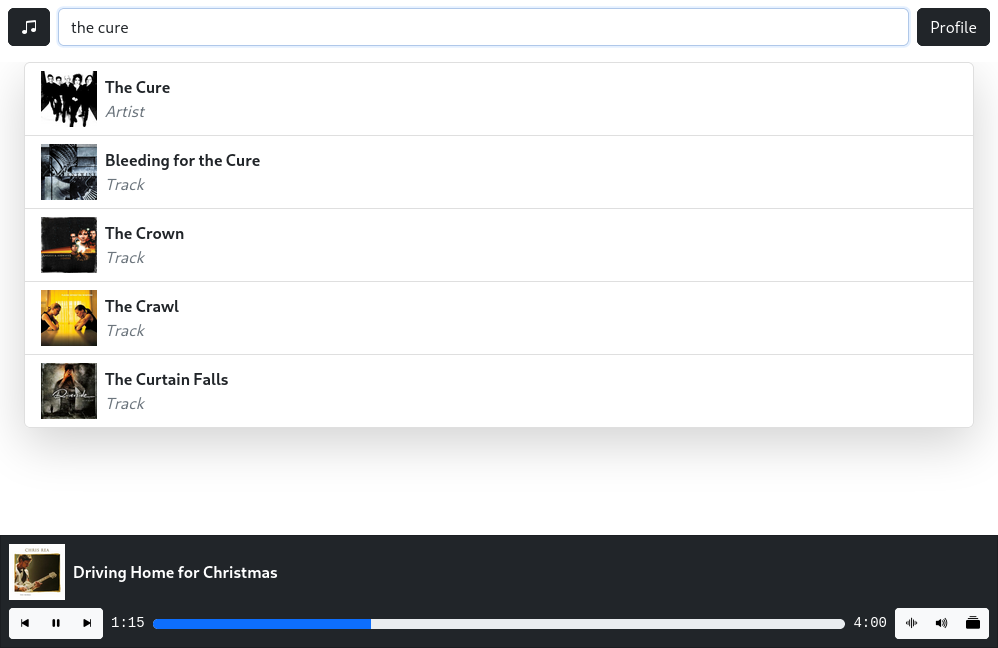

# Forte

**Self-hosted, music streaming platform**

## Server Setup
1. `git clone https://github.com/kaangiray26/forte.git`
2. `cd forte/server`
3. `npm install`
4. `npx greenlock init --config-dir ./greenlock.d --maintainer-email '<your email here>'`
5. `npx greenlock add --subject yourdomain.tld --altnames yourdomain.tld`
6. Change the library path in `server/config.json`
7. Install and start a postgresql database with a database named `forte` with a user named `forte` on `localhost:5432`
8. `sudo node start`

## Screenshots

