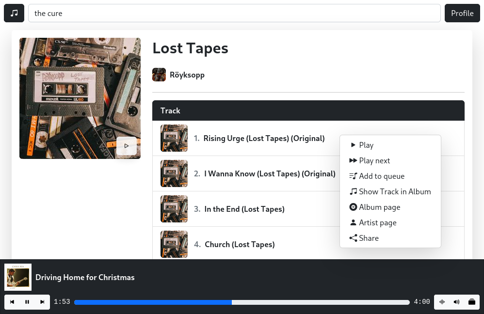
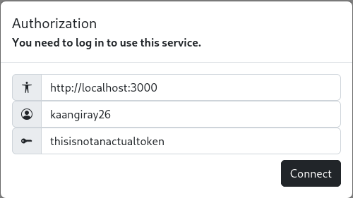
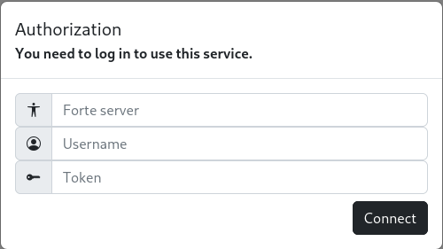

# Forte


**Self-hosted, music streaming platform**


[More screenshots](images/screenshots.md)

## Features
* [x] Add tracks and albums to your queue
* [x] Listen to radio streams
* [x] Mark your favorite tracks, albums, artists, playlists
* [x] Create playlists
* [x] Specialized context menus
* [x] Desktop / Mobile Player
* [x] Make fuzzy searches
* [x] Add friends
* [x] Playing controls
* [x] Keyboard shortcuts
* [x] Lyrics support

# Getting started

forte is a self-hosted music platform. You can either **connect to a forte server** or **create your own server** for your friends & family. However, it is also very convenient to use forte on your local machine as a **standalone music player**. Follow this guide to learn how to connect and how to build your own forte server.

### Using forte
If you know a forte server and just want to connect to use the service, go to https://forte.buzl.uk. The webpage is hosted with GitHub pages and uses the latest forte version. Therefore, this is the **recommended way** to access forte services.

Once you go to the website, you will be prompted with this dialog:



Here's an explanation for the fields:
```
Forte server: The public address of the forte server.
Username    : The username given to you by the server.
Token       : The token given to you by the server.
```

If you are wondering about how to create accounts, this will be explained in the `Creating your own server` section.

Here's an example for the authorization:



If you log in successfully, you will see the homepage of the application, where some track recommendations can be found. Now you can use the application and listen to some music.

Once you log in, your authorization parameters will be saved on the local session of your browser. However, if you ever want to reset these information, you can right click on the `Profile` button on the top right of the screen, you will see an option to `Reset`. This will clear the local storage along with your session storage.

### Creating your own server
To build and host your own server you need a decent computer as we will be dealing with multiple users and streaming audio files to them. In the remaining of this section, we will be going over the steps of building the server. However, we won't be focusing on installing the PostgreSQL server.

---

Before you go through the following steps, you need a PostgreSQL server with a database named `forte`, a user named `forte`, working on `localhost:5432`.

Follow these steps to install the forte server on your machine.
```
git clone https://github.com/kaangiray26/forte.git
```
```
cd forte/server
```
```
npm install
```
Now change the library path and genius token in `forte/server/config.json`.
### Using locally
```
node local.js
```
### Using publicly
```
npx greenlock init --config-dir ./greenlock.d --maintainer-email '<your email here>'
```
```
npx greenlock add --subject yourdomain.tld --altnames yourdomain.tld
```
```
sudo node server.js
```

## Keyboard Shortcuts
* [**S**] Search
* [**L**] Show Lyrics
* [**Q**] Open Queue
* [**M**] Mute/Unmute
* [**Space**] Play/Pause
* [**Left Arrow**] Previous song
* [**Right Arrow**] Next song
